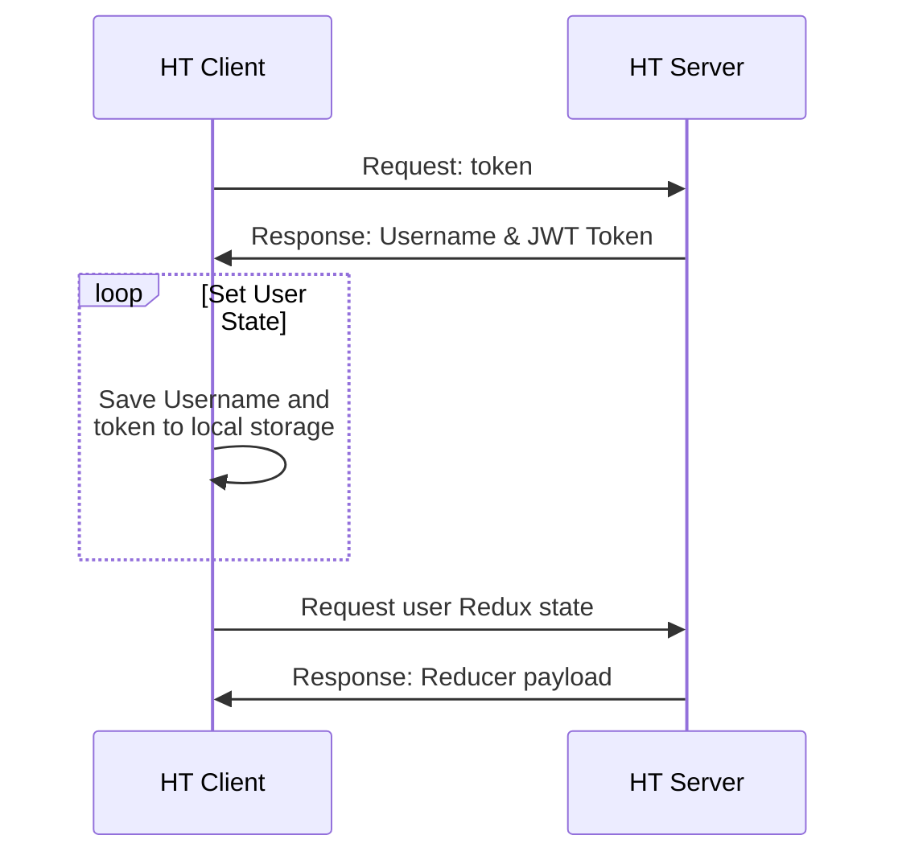

```mermaid
sequenceDiagram
    participant C as HT Client
    participant S as HT Server
    C->>S: Request: token
    S->>C: Response: Username & JWT Token
    loop Set User State
        C->>C: Save Username and <br> token to local storage
    end
    C->>S: Request user Redux state
    S->>C: Response: Reducer payload 
```
