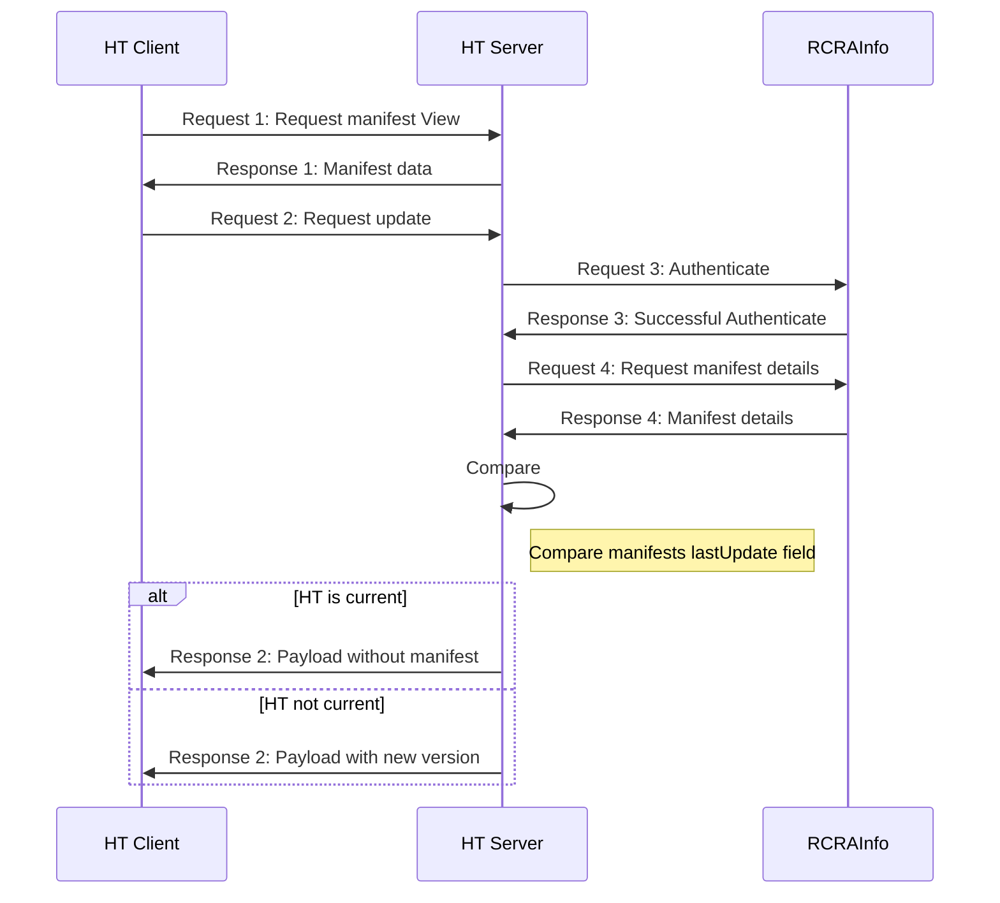

```mermaid
sequenceDiagram
    # Participants
    participant C as HT Client
    participant S as HT Server
    participant R as RCRAInfo
    
    # steps
    C->>S: Request 1: Request manifest View
    S->>C: Response 1: Manifest data
    C->>S: Request 2: Request update

    S->>R: Request 3: Authenticate
    R->>S: Response 3: Successful Authenticate
    S->>R: Request 4: Request manifest details
    R->>S: Response 4: Manifest details
    S->>S: Compare
    Note right of S: Compare manifests lastUpdate field
    alt HT is current
        S->>C: Response 2: Payload without manifest
    else HT not current
        S->>C: Response 2: Payload with new version
    end
    
```
