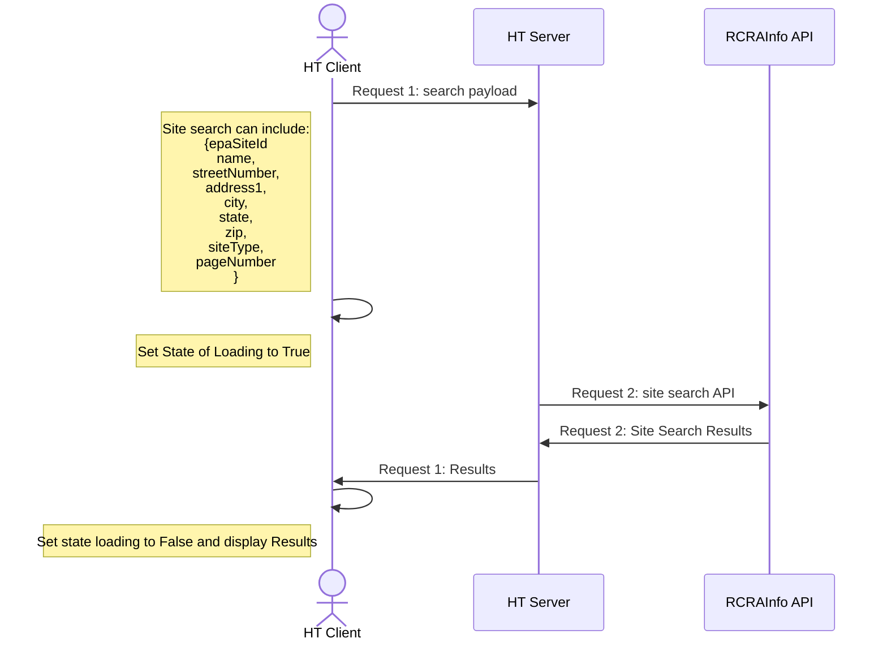

```mermaid
sequenceDiagram
    actor C as HT Client
    participant S as HT Server
    participant R as RCRAInfo API
   
   C->>S: Request 1: search payload
   note left of C: Site search can include: <br> {epaSiteId<br>name,<br>streetNumber,<br>address1,<br>city,<br>state,<br>zip,<br>siteType,<br>pageNumber<br>}
   C->>C: 
   note left of C: Set State of Loading to True
   S->>R: Request 2: site search API
   R->>S: Request 2: Site Search Results
   S->>C: Request 1: Results
   C->>C: 
   note left of C: Set state loading to False and display Results
   

```
