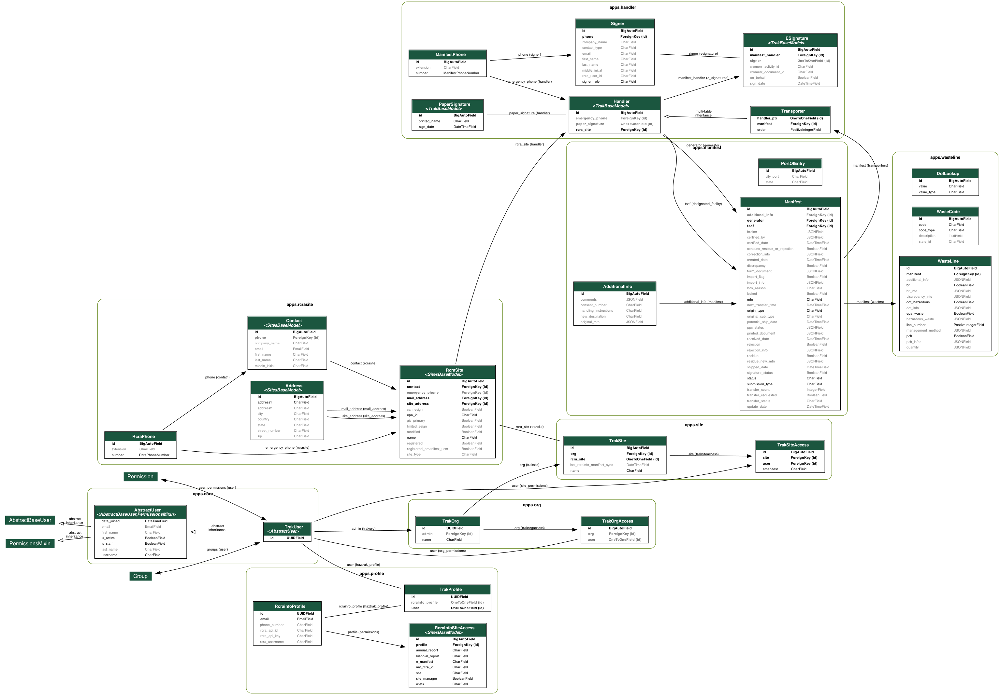

# Database Design



## Overview

Haztrak depends on a relational database to persist its user data as well as
information synced with (pulled from) RCRAInfo. RCRAInfo/e-Manifest should
always be treated as the source of truth, however, the database provides users
the means to, for example, draft or update electronic manifests without submitting
the changes to RCRAInfo immediately.

The database schema is maintained in version control via a series of 'migration'
scripts. This also enables haztrak to initiate a new database and scaffold the expected
schema quickly and consistently for local development, testing, and backup.

The Haztrak project currently utilizes [PostgreSQL](https://www.postgresql.org/),
a widely used open-source object-relational database system known for reliability and performance.

## Notes on generating the ERD

We use the `pygraphviz` python library and the `django-extensions` reusable Django app to generate the above entity relationship diagram (ERD).

### Installing Header Files

This library doesn't come with pre-compiled [wheels](https://realpython.com/python-wheels/), so you'll need to install the C header files.

Fedora/RHEL

```shell
dnf install python3-devel graphviz-devel
```

Ubuntu/Debian

```shell
apt-get install libpython3-dev libgraphviz-dev
```

after installing the necessary header files, install the `pygraphviz` package from PyPI.

```shell
pip install pygraphviz
```

### Generate the ERD

Use the runhaz.sh shell script to (re)generate the ERD.
It applies some default flags to the `pygraphviv` command to constrain and style
the ERD to fit our documentation needs.

Use `./runhaz.sh -h` for help.

```shell
./runhaz.sh -e
```
