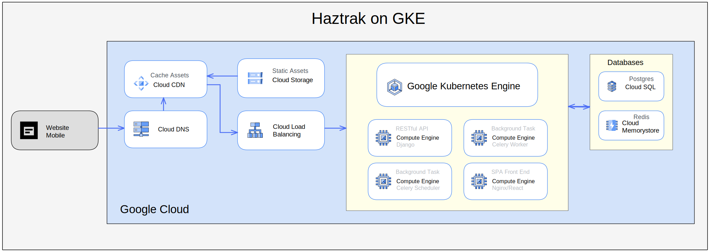

# Source Design Document

This document's purpose is to outline Haztrak's system architecture and design. For more information on the project's specifications and requirements, see the [Software Requirements Specification](./srs.md).

- [introduction](#source-design-document)
- [Purpose](#purpose-of-haztrak)
- [Specification](#scope)
- [Architecture](#architecture)
  - [Front End components](#front-end)
    - [Client](./browser-client.md)
    - [Admin Dashboard](#a)
  - [Back End Services](#back-end)
- [Testing](#testing)
- [Requirements](#requirements)
- [Versioning](#versioning)

## Architecture Overview

As a reference implementation, Haztrak follows a service oriented design however it would not be classified as a microservice architecture. The project is partitioned into a select number of containerized components that are deployed separately but closely work together, including:

1. An [HTTP server](#http-server) that provides a RESTful API for the client and admin site.
2. A relational database for persisting user data and data synced with RCRAInfo.
3. An in memory database (caching layer)
4. A task queue
5. A task scheduler
6. A [browser client](#client)

## Architecture

This section provides a high-level overview of how responsibilities of the system
are partitioned between system components/services.

While not a "microservice" by design, Haztrak system can be described as a series of services.

### Front End

The Front End consist of two user interfaces.

#### [A React user interface (client)](./browser-client.md)

#### Admin Site

The Admin site provides a quick, model-centric interface where trusted
users can manage content. It's not intended to provide a process centric interface,
admin user's should not be, for example, signing manifests through the admin site.

The admin interface is an out-of-the-box feature of the [Django framework](https://docs.djangoproject.com/en/4.1/ref/contrib/admin/).
It can be found by appending `/admin` to the URL of the host and port of HTTP server, for example `http://localhost:8000/admin`

### Back End

The back end contains the following components:

1. An HTTP server
2. A relational database
3. An in memory database (caching layer)
4. A task queue
5. A task scheduler

#### Relational Database

Haztrak depends on a relational database to persist its user data as well as
information synced with (pulled from) RCRAInfo. RCRAInfo/e-Manifest should
always be treated as the source of truth, however, the database provides users
the means to, for example, draft or update electronic manifests without submitting
the changes to RCRAInfo immediately.

The database schema is maintained in version control via a series of 'migration'
scripts. This enables us to initiate a new database and scaffold the expected
schema quickly and consistently for local development, testing, and backup.

The Haztrak project currently utilizes [PostgreSQL](https://www.postgresql.org/),
a widely used open-source object-relational database system known for reliability and performance.

For more information, see our [chapter on database design](./db-design.md)

#### In-memory Database

The in-memory data store serves a couple purposes,

- As a message broker for Haztrak's [task queue](#task-queue)
- A cache for the [http server](#http-server)

As a cache, the in-memory data store is utilized to increase performance by allowing Haztrak to cut down on latency for recently used resources including recent database queries, and computed values. As a message broker, the data store provides a reliable way for the back end service to communicate which each other (e.g., launch background tasks).

The Haztrak project currently uses [Redis](https://redis.io/) as both the message broker and in-memory data store.

#### Task Queue

The task queue is responsible for jobs/scripts/tasks/batch processing that should occur outside
the [http request-response cycle](https://en.wikipedia.org/wiki/Hypertext_Transfer_Protocol).
For Haztrak, a large part of this is communicating with RCRAInfo via
its [web services](https://github.com/USEPA/e-manifest), a well documented
RESTful API. Offloading these external API calls keeps our user experience
feeling snappy and protects our [http server](#http-server) from network
errors cause by downtime in external systems.

The task queue can be scaled horizontally to include additional workers as needed.
We also deploy [task schedulers](#task-scheduler) for periodic tasks.

The Haztrak project uses the distributed task queue, [Celery](https://docs.celeryq.dev/en/stable/)

For more information, see our [chapter on the task queue](./task-queue.md)

#### Task Scheduler

The scheduler kicks off tasks at regular intervals, that are then executed by available
worker in the task queue. Only a single scheduler is running at any given point to avoid
duplicating tasks. Periodic tasks can be scheduled by:

- (Crontab)[https://crontab.guru/]
- Solar events (e.g., every day at sundown)
- Periodically (e.g., every 10 minutes)

The Haztrak project uses Celery's
[beat module](https://docs.celeryq.dev/en/stable/userguide/periodic-tasks.html) to schedule periodic tasks.

For more information, see our [chapter on the task queue](./task-queue.md)

#### HTTP server

The RESTful API serves data to hydrate the client and handles user authentication.
It is client agnostic, so it's not tied to any specific client, whether it be a
browser or mobile application. The API does not directly communicate with RCRAInfo,
but instead manages tasks provided by the task queue and passes on any necessary parameters.

The Haztrak Project makes extensive use of the
[Django framework,](https://www.djangoproject.com/) and it's ecosystem.

For more information, see our [chapter on the HTTP server](./http-server.md)

## Testing

Haztrak employs a suite of automated tests for the HTTP server, the http client
(user interface), and the task queue. We rely heavily on these tests, as well as
our continuous integration pipeline to ensure that regressions do not enter the
base branch (often called 'main' or 'master').

We intentionally do not aim for 100% code coverage with our test suite because,
what inevitably happens, is the test suite contains a bunch of low quality tests.

The Haztrak project uses the [pytest framework](https://docs.pytest.org/en/7.2.x/)
for testing the backend python services to write readable, [DRY](https://en.wikipedia.org/wiki/Don%27t_repeat_yourself) tests.

For more information, see our [chapter on testing](./testing.md)

## Requirements

What dependencies and things needed to be able to deploy/build Haztrak.

## Versioning

Haztrak uses [semantic versioning](https://semver.org/) to keep track
of its software releases. Semantic versioning is a widely used versioning system that allows
developers to convey the nature of the changes in the software using
a version number.

The Haztrak project stores versions are in
[Git tags](https://git-scm.com/book/en/v2/Git-Basics-Tagging). When a new
version of the software is released, a new Git tag is created to represent that version.
these tags are then used for the container images that are built and
released for that version. Since the Git tag and image tag correspond,
the source for a given container tag can always be easily found. Containers built
from non-release commits should use

Haztrak is stored in a monorepo, the front-end and back-end
containers are built and released simultaneously with the same version number.
