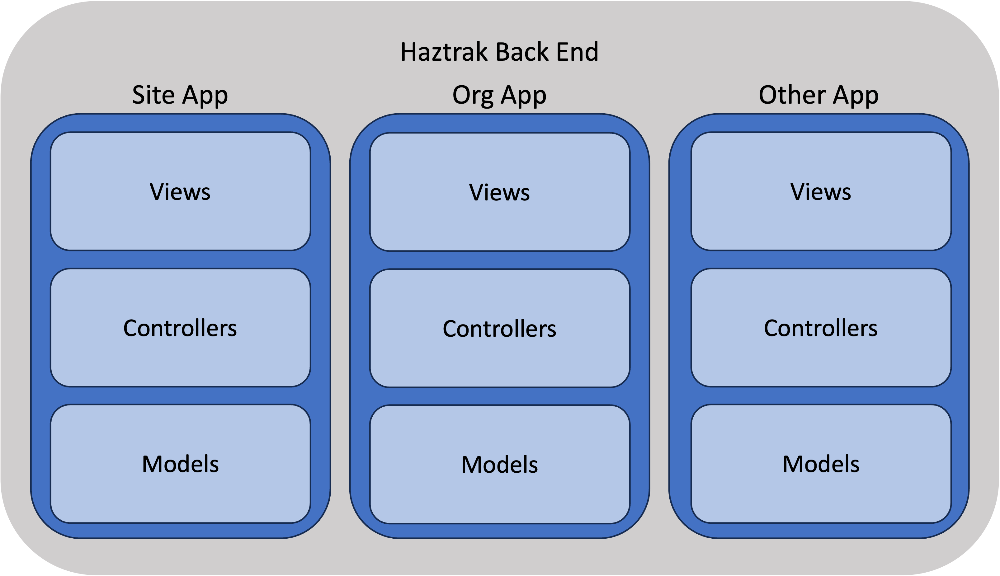

# Source Roadmap

We know that finding your way around a new codebase can be tough.
This chapter will get you acquainted with the project and repository structure.

```
├── /configs                 : Example configuration to be passsed as environment variables
├── /docs                    : project written documentation
├── runhaz.sh                : shell script for aiding local development
├── /client                  : Root for the single page application
│   ├── /...
│   ├── /public              : public content and static assets
│   └── /src
│       ├── /components      : React componets and building blocks
│       ├── /features        : Higher level components
│       ├── /hooks           : Custon hooks
│       ├── /services        : Library for consuming web services
│       └── /store           : Global store slices and logic
└── /server                  : Root for the Django http server
    ├── /core                : features on the backend are split into 'django apps'
    ├── /site                : e.g., the 'site' app encapsulates the TrakSite model, views, and logic
    ├── /...                 : More apps, excluded for brevity
    ├── /org                 : An app generally follow the pattern found in the django docs
    │   ├── /migrations      : Database migration
    │   ├── /models          : Entity/Model definitions for database persistence
    │   ├── /serializers     : Serializers for encoding Python objects (e.g., to JSON)
    │   ├── /services        : Business logic
    │   ├── /tasks           : Asynchronous tasks (e.g., used to interface with RCRAInfo)
    │   ├── /tests           : Tests specific to this django app
    │   └── /views           : Our Django (DRF) views
    ├── /fixtures            : Initial data loaded on start for development
    ├── /haztrak             : Backend configuration that glues everything together
    └── ...                  : Configuration module
```

## Notable Directories

### Server

Notable directories for server development and source control

#### The Django Apps

[`server/`](https://github.com/USEPA/haztrak/tree/main/server/)
This directory houses all our Django apps (Django refers to each one of these as an 'app', not to be confused with the
smallest deployable unit which is a 'project', a project uses many apps). On many Django projects the apps would be in
the root of the project, we keep them in 'server' for organizational purposes.

Each app constitutes a vertical slice through our back end system.

[](https://docs.djangoproject.com/en/3.2/ref/applications/)

#### The Core App

[`server/core`](https://github.com/USEPA/haztrak/tree/main/server/core)
This app contains our user model, authentication, and things that a used by many other apps.
Future work will remove unnecessary dependencies on this app from other apps.

#### The Site App

[`server/site`](https://github.com/USEPA/haztrak/tree/main/server/site)
This app contains the `TrakSite` entity, views, and logic.
A `TrakSite` is a location that where EPA regulated activity occurs that our users work with.
Haztrak only supports working with regulated activities that fall under
regulations promulgated under the Resource Conservation and Recovery Act (RCRA),
Due to Haztrak's scope, a `TrakSite` will always have a `RcraSite`, but not always the other way around.
but theoretically, a `TrakSite` could also correspond to a location where other environmental
regulated activities occur such as Clean Air Act (CAA) or Clean Water Act (CWA) regulated activities.

#### The RCRASite App

[`server/rcrasite`](https://github.com/USEPA/haztrak/tree/main/server/rcrasite)
This app contains the `RcraSite` models. A `RcraSite` is a location that is known to the EPA's RCRAInfo system.

#### The Org App

[`server/org`](https://github.com/USEPA/haztrak/tree/main/server/org)
This app contains the `TrakOrg` (short for "Trak Organization") model, views, and logic.
A `TrakOrg` is an organization allows Haztrak to tie together users and sites.
An Org is managed by one or more admins, admins can control RBAC to `TrakSite`s for the organization's users.
EPA's RCRAInfo system does not have a concept of an organization.

### Client

Notable directories for client development and source control

#### Client Features

[`client/src/features`](https://github.com/USEPA/haztrak/tree/main/client/src/features)
This directory, contains our features. Features consume [components](#client-components) the redux store slices.
Generally, features map to routes the user can take.
A feature component only relies on global state/context and does not accept any props.

#### Client Components

[`client/src/components`](https://github.com/USEPA/haztrak/tree/main/client/src/components)
This directory contains basic components that act as building blocks for features.
Ideally, components should be 'dumb', only consuming props and not relying on global state/context,
however we have not been strict about this. But please keep this in mind as this generally keeps
the component more testable, more focused, and easier to understand.

Components should be organized by concept, not by role (i.e., don't put all buttons in a `Button` directory).
The hierarchy of our component dependencies should generally follow a tree structure.
For example, if a `MyManifest` component depends on a `ManifestGeneralDetails` component, the `ManifestGeneralDetails`
be in the same directory or a subdirectory of the `MyManifest` component.
The corollary to this is the `UI` directory, which contains components that do not contain any logic, and are used by
any component in the application.
