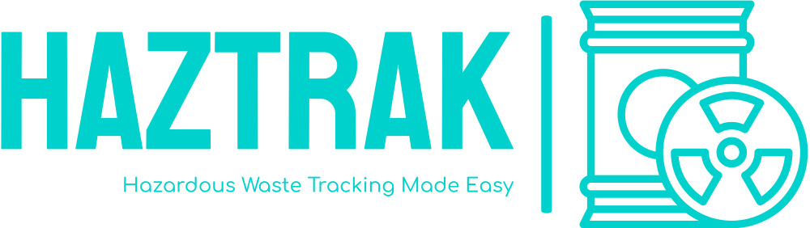

Haztrak is an overkill proof of concept (POC) project that illustrates how third party system can leverage the resources exposed by the
U.S. Environmental Protection Agency's IT systems, [RCRAInfo](https://rcrainfo.epa.gov) and [e-Manifest](https://github.com/USEPA/e-manifest). More specifically, how these resources can be leveraged to electronically manifest [hazardous waste](https://www.epa.gov/hw) shipments to ensure proper management from cradle-to-grave instead of the manual and paper intensive process that has been in place since the 1980's.

Please keep in mind that Haztrak is labor of love, there's aspects of Haztrak that will
likely never be ready for a production deployment. Our entire budget is our spare time.

## Report an Issue or Ask Questions

See a mistake in this documentation? Have a suggestion or questions? Submit
an issue to our [issue tacker](https://github.com/USEPA/haztrak/issues/new/choose)
