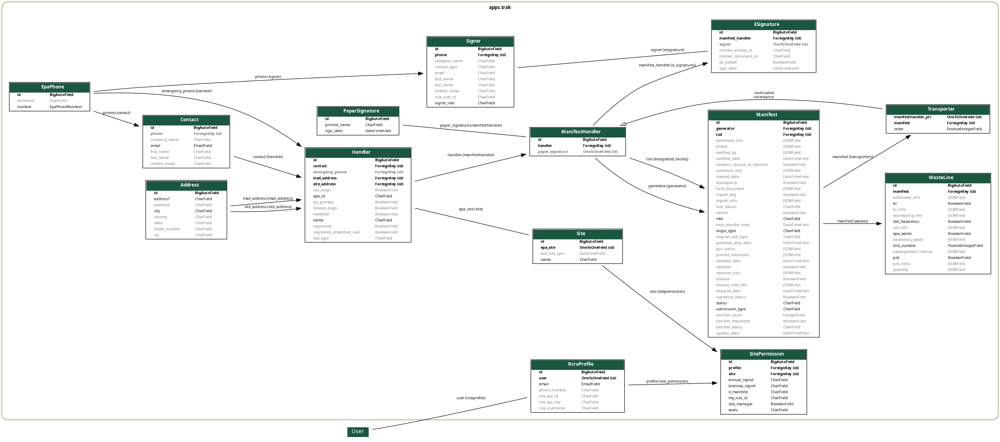

# Database Design



## Overview

ToDo

## Django ORM

Haztrak uses the Django Framework's ORM (Object-Relational Mapping), a powerful tool
that allows Haztrak to define the schema for, and interact with, the databases using Python
objects instead of writing raw SQL queries.
See the [Django model layer documentation](https://docs.djangoproject.com/en/4.1/topics/db/models/) for a more comprehensive introduction.

## DB Migrations

In addition to defining the database schema through Django's ORM, Django also comes with built-in
support for managing database changes through [migration scripts](https://cloud.google.com/architecture/database-migration-concepts-principles-part-1). These migrations are checked into
source control, which can then be applied to a standing database or used to spin up a new database
as the current database schema is simply the sum of its changes.
See the [Django Migrations documentation](https://docs.djangoproject.com/en/4.1/topics/migrations/)
for more information.

## Notes on generating the ERD

We use the `pygraphviz` python library and the `django-extensions` reusable Django app to generate the above entity relationship diagram (ERD).

### Installing Header Files

This library doesn't come with pre-compiled [wheels](https://realpython.com/python-wheels/), so you'll need to install the C header files.

#### Fedora/RHEL

On Fedora (37) the following packages can be installed to meet this requirement.

```shell
dnf install python3-devel graphviz-devel
```

#### Ubuntu/Debian

The following packages should accomplish the same task, however this is untested.

```shell
apt-get install libpython3-dev libgraphviz-dev
```

### Python Dependencies

after installing the necessary header files, install the `pygraphviz` package from PyPI.

```shell
pip install pygraphviz
```

### Generate the ERD

Use the runhaz.sh shell script to (re)generate the ERD.
It applies some default flags to the `pygraphviv` command to constrain and style
the ERD to fit our documentation needs.

Use `./runhaz.sh -h` for help.

```shell
./runhaz.sh -e
```
