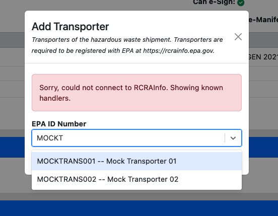

# Local Development Environment

This chapter provides everything you need to know to set up a local development environment
to work on Haztrak.

If you find something missing or inaccurate, please submit an issue
[here](https://github.com/USEPA/haztrak/issues)

## Contents

1. [Set up with Docker Compose](#docker-compose)
2. [Fixtures](#fixtures)
3. [Using RCRAInfo interfacing features](#rcrainfo-api-credentials)
4. [Development Configs](#development-configs)
5. [Developing without Docker](#local-development-without-docker)

## Docker Compose

- The easiest way to set up a local development environment is to
  use [docker compose](https://docs.docker.com/compose/gettingstarted/)
  - You can use one of our [config file](/configs) to inject the
    [environment variables](../deployment/configuration.md) needed to configure Haztrak (
    see [docker composes' documentation on environment files](https://docs.docker.com/compose/environment-variables/set-environment-variables/)).
  - You can either use the `--env-file` flag

```shell
docker compose --env-file configs/.env.dev up --build
```

or copy the config file to the project root as a `.env` file, modify it if needed, and docker will apply it by default.

```shell
cp ./configs/.env.dev .env
docker compose up --build
```

Don't forget the `--build` flag, or you'll be running the last built image instead of the Dockerfile's build target
that we've specified in the [docker-compose.yaml](https://github.com/USEPA/haztrak/blob/main/docker-compose.yaml) file.

## Fixtures

- On start, fixtures will be loaded to the database, including 2 users to aid local development.

<!-- prettier-ignore -->
| username  | password  |
|-----------|-----------|
| testuser1 | password1 |
| admin     | password1 |

- The admin user has superuser privileges and can also log in to
  the [django admin portal](https://docs.djangoproject.com/en/4.1/ref/contrib/admin/).

Fixtures will also load a couple of sites.

1. `VATESTGEN001` - a preproduction site hazardous waste generator
2. `MOCKTRANS001` - a mock transporter site
3. `MOCKTRANS002` - a mock transporter site
4. `MOCKTSDF001` - a mock TSDF site

By Default, `testuser1` only has access to `VATESTGEN001`, the mock sites can be used to draft electronic manifests.



## RCRAInfo API credentials

Haztrak's [docker-compose](/docker-compose.yaml) file will load fixtures, however this data is limited.
If you'd like to start using features that push/pull information from RCRAInfo/e-Manifest, you will
need API credentials to the appropriate RCRAInfo deployment (e.g., 'preproduction').

For development, **ONLY USE THE PREPRODUCTION
** environment. See [Haztrak's config documentation](../deployment/configuration.md).

The general steps for obtaining an API ID and key (in preprod) are as follows.

1. Register for an account in [RCRAInfo (PreProduction)](https://rcrainfopreprod.epa.gov/rcrainfo/action/secured/login)
2. Request access to one fo the test site EPA IDs (e.g., VATESTGEN001)

   - You'll need 'Site Manager' level access to obtain API credentials
   - Await approval, or contact EPA via the "Feedback/Report an issue".

3. Login after approval, generate your API Key.

For additional information on obtaining API credentials, see the
[USEPA/e-Manifest GitHub repository](https://github.com/USEPA/e-manifest)

## Development Configs

Haztrak includes a couple configs to help ensure contributions use a consistent
style guide. Most popular IDEs have a plugin to support these configs.

- pre-commit
  - [pre-commit](https://pre-commit.com/) hooks are set to run a number of linting and formatting checks before commits on any branch is accepted.
  ```shell
   pip install -r requirements_dev.txt
   pre-commit install
  ```
- .editorconfig
  - Universal IDE configs for formatting files, most IDEs will have a plugin you can
    install that will apply these configs.
- runhaz.sh
  - A bash script to help with development
  - See usage with `$ ./runhaz.sh -h`
- Prettier
  - [Prettier](https://prettier.io/) is used to autoformat source files, specifically
    the most of our non-python files. If you're using an IDE, it will likely have a prettier plugin available.
  - The configs are found in [.prettierrc.json](/.prettierrc.json)
    and [.prettierignore](/.prettierignore)
- [Black](https://black.readthedocs.io/en/stable/#)
  - Black is a Python formatter from the
    [Python Software Foundation](https://www.python.org/psf-landing/). It's very opinionated and largely unconfigurable.
- [Ruff](https://docs.astral.sh/ruff/)
  - ruff is a Python linter and (recently) formatter. It provides a fast and pleasant developer experience.
- [MyPy](https://mypy-lang.org/)
  - Haztrak is (currently in the process) incrementally adopting type hints. MyPy is a static type checker for Python.

## Local Development Without Docker

While it is possible, local development without containerization (docker) is not supported.
